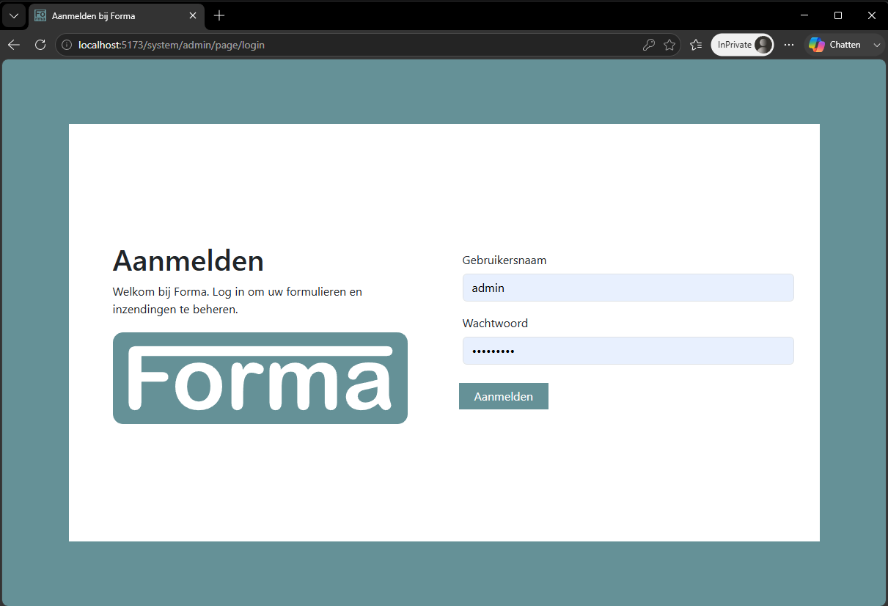
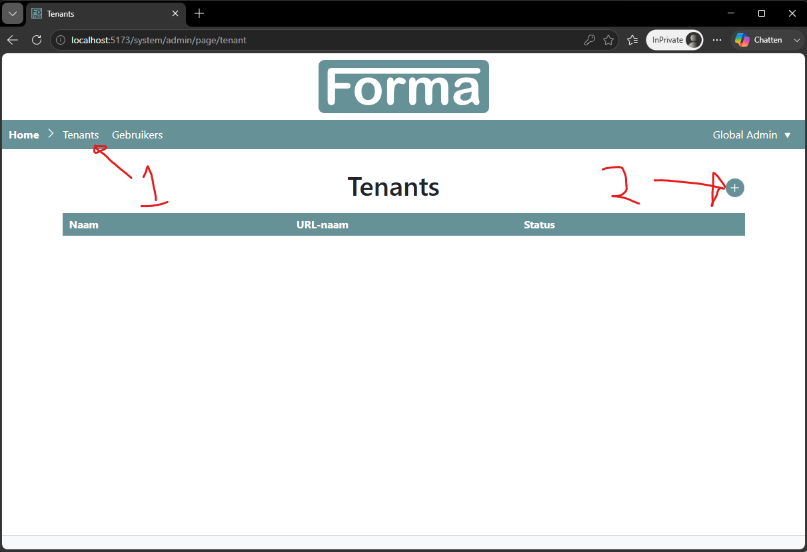
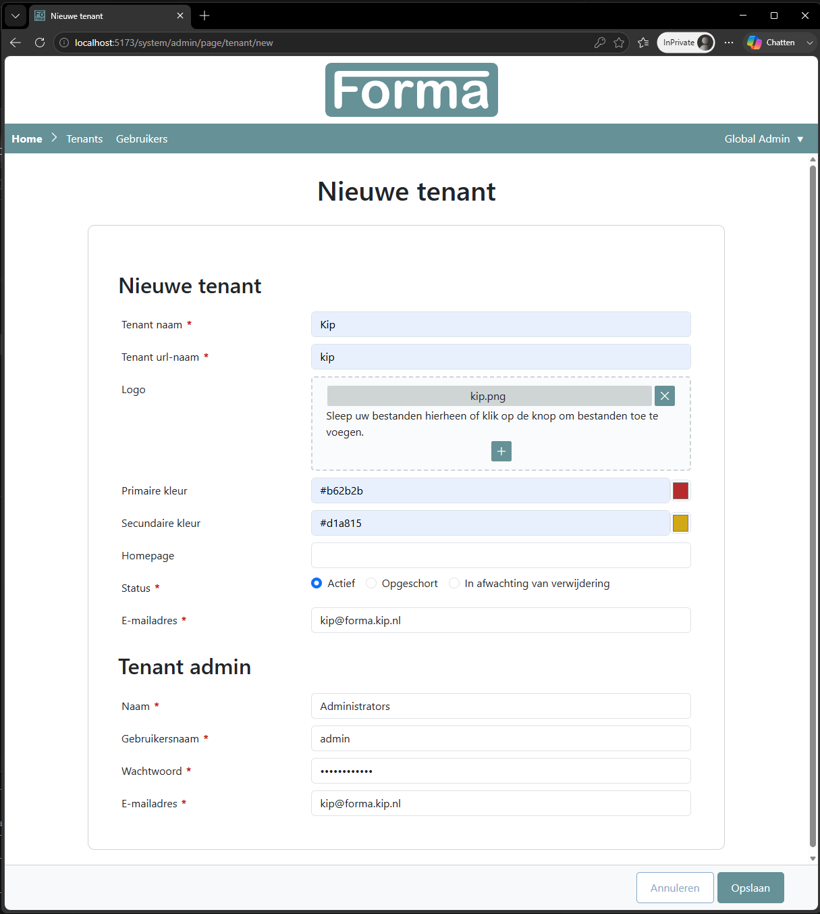
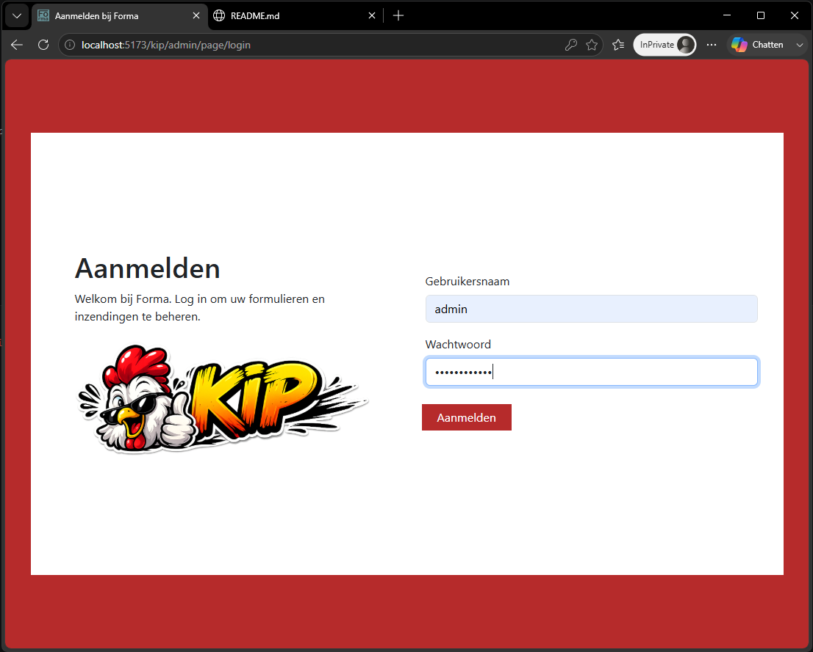
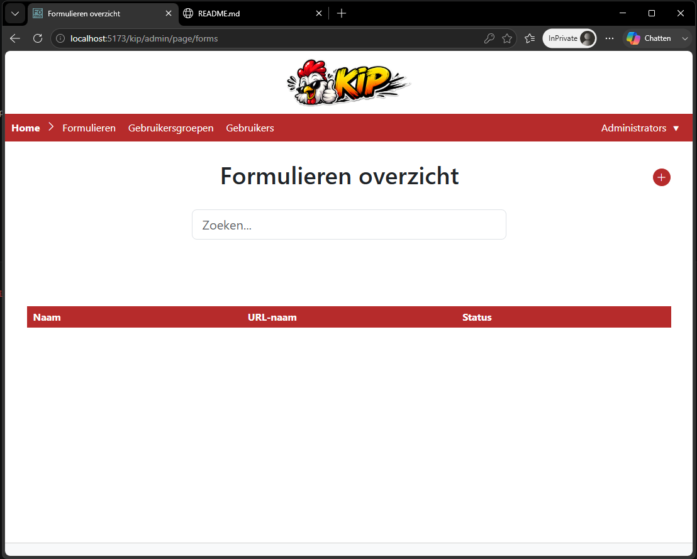
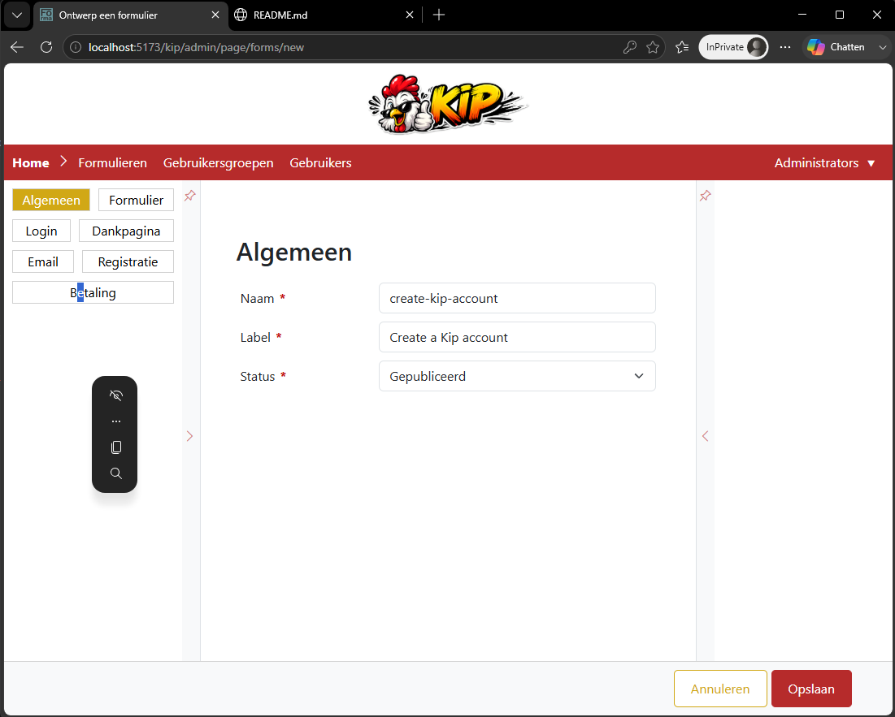
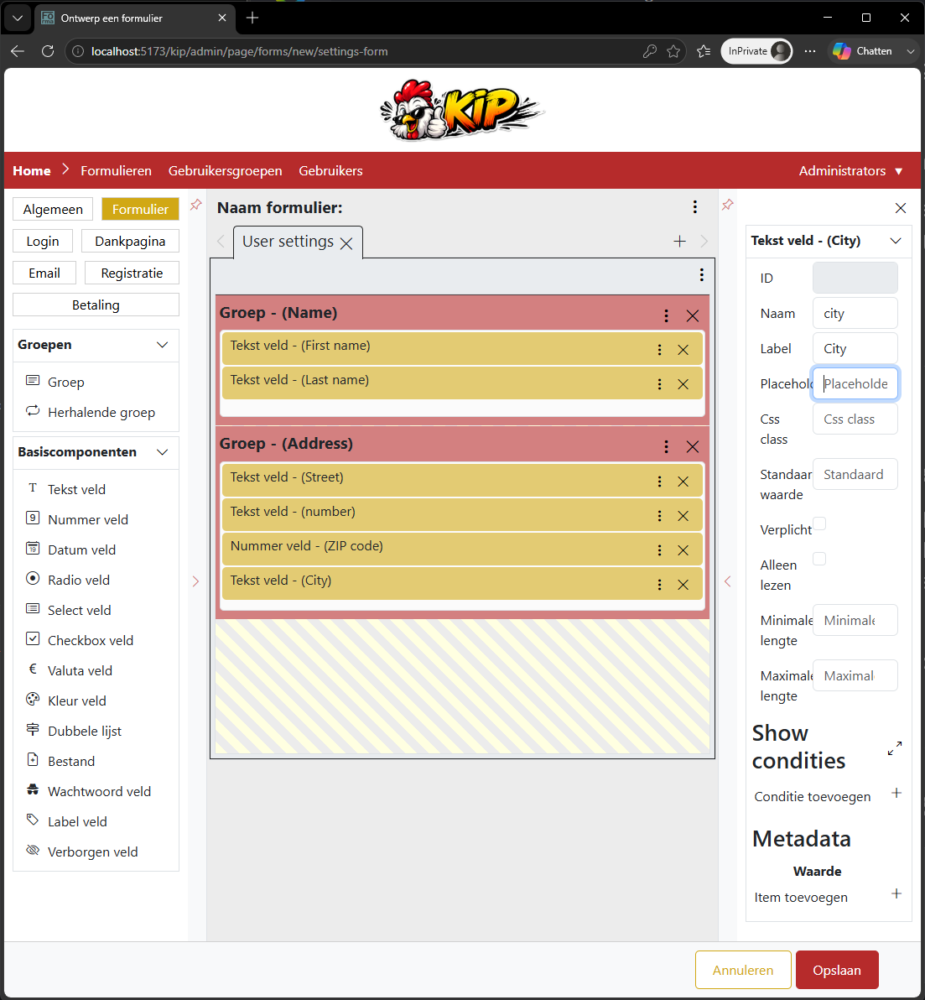
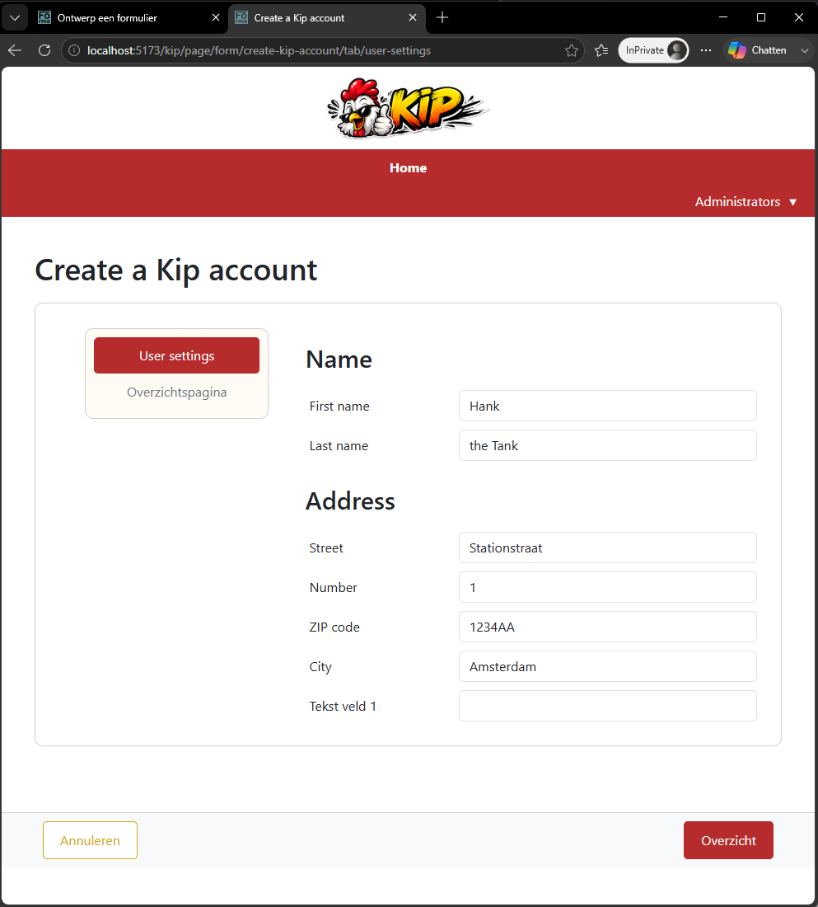
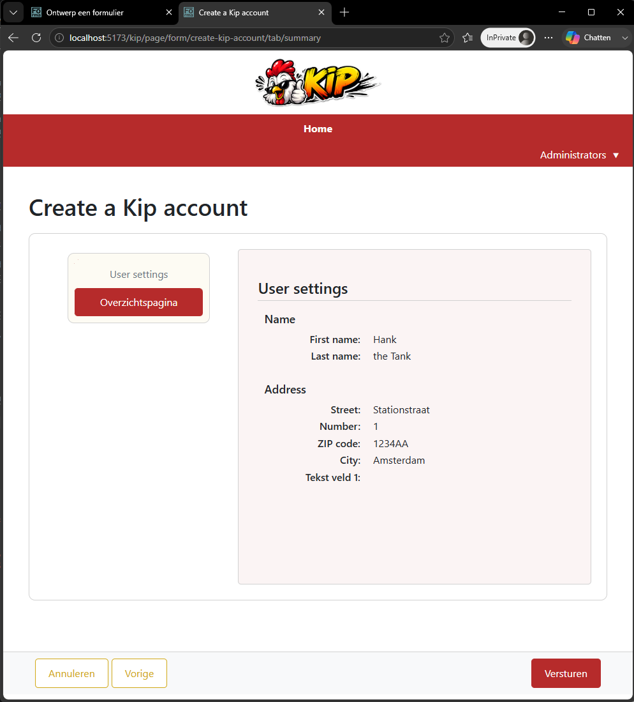

# Forma - build your own forms
This tool can be used to host your own forms platform. It can be used to host simple and complex forms.

# Project startup
This project is still being developed. To run the project you'll need to follow the steps beneath.

# Prerequisites
- Docker
- Java
- MVN (https://maven.apache.org/download.cgi#CurrentMaven)
- NPM

## Setup Java
### Windows
- Download and install java jdk 25
- Add the bin folder to the PATH (example: PATH=C:\INSTALL_DIR\jdk-25.X.X.X\bin)
- Create a system variable: JAVA_HOME=C:\INSTALL_DIR\jdk-25.X.X.X

### WSL
- sudo apt update && sudo apt upgrade -y
- sudo apt install openjdk-25-jdk -y

## Setup MVN
### Windows
- Download the MVN zip from the website.
- Extract the zip-file in a folder of choice.
- Add the bin folder to the PATH (example: PATH=C:\INSTALL_DIR\apache-maven-3.9.12\bin)

### WSL
- sudo apt update && sudo apt upgrade -y
- sudo apt install maven -y

## Setup NPM
### Windows
- Download Node: (https://nodejs.org/en)
  Make sure that "Add to PATH" is checked when installing
- Check the version
  node -v
  npm -v

### WSL
- nvm install --lts
- Check the version
  node -v
  npm -v

# Setup
This setup is for people who want to run the project locally.

1. copy the file .env.sample and rename it to .env
2. open the .env file and set the properties

3. copy the file s3.json.sample and rename it to s3.json
4. open the s3.json file and set change the accessKey and secretKey to match the properties in the .env

# Run forma
1. start the docker application (on windows)
3. Run the command in a terminal:
   - docker-compose up
4. Open a terminal:
   - Browse to the folder /backend
   - Run the command: mvn spring-boot:run
5. Open a terminal
   - Browse to the folder /frontend
   - Run the command: npm run dev
5. Open a browser and navigate to:
    http://localhost:5173/system/admin

    The path system is reserved for te global_admin. Within this page you can create new tenants and setup global settings.

    For login you can use the ADMIN_USER and ADMIN_PASS defined in .env

# Create a new tenant
1. Navigate to http://localhost:5173/system/admin

2. Login to the system admin panel as global admin

3. Click first on tenant and second on the add button

4. Fill the specific fields. (the sample image is found in the folder sample-data/kip.png)

5. Click on the save button.

# Create a new form
1. Navigate to http://localhost:5173/kip/admin

2. Login to the kip admin panel as tenant admin

3. Click first on forms and second on the add button

4. Give the form a name and a status

5. Click on the form button and create the required pages and fields

6. Click on Save

# Submit a form
1. Navigate to: http://localhost:5173/kip/page/form/create-kip-account

2. Fill in the form

2. Submit the form

# Recreate the enviroment (clean start)
- docker-compose down -v
- docker-compose up -d --force-recreate
- mvn spring-boot:run

# Database dump
docker exec -i forma-database pg_dump -U forma --column-inserts --data-only --disable-triggers FormaDB > data.sql

# Dev guide

## fields
Every field needs to be defined at three places:
- backend
- builder
- frontend

### Backend
Fields in the backend are an instance of the Field class. The Field class contains a set of base variables and methods that are needed to instantiate, validate all components of a form. The form itself and the tab-pages are also Fields.

**Define a new type**
1) Every new field type needs to extend the Field class. Also every new field-type needs to be added as a JsonSubType in the Field class

2) The new type needs to be added to the FieldType enum

3) When a field is loaded from the database it needs to be the right type of field. This can be done in the FieldMapper.

# Fonts
The fonts are created with fantasticon.
The images that are used for the fonts are /src/main/resources/static/includes/images
fantasticon /mnt/...../src/main/resources/static/includes/images -o OUTPUT_DIRECTORY

After the fonts ar created in the directory src/main/resources/static/includes/css/fonts
I change this:
i[class^="icon-"]:before, i[class*=" icon-"]:before

To this:
[class^="icon-"]:before, [class*=" icon-"]:before

A new icon can be used when you add a class on a dom-object:
- icon icon-NEW_ICON_NAME
for example:
- icon icon-palette